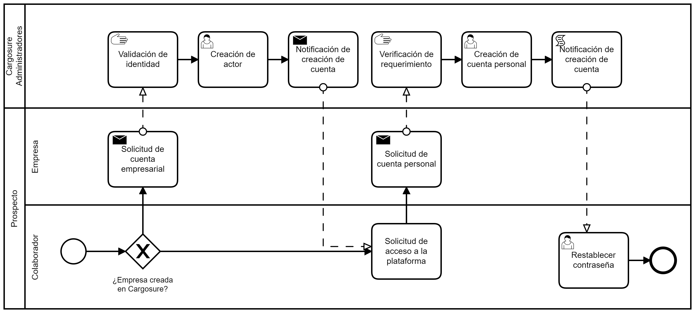

# Acceso

El acceso a la plataforma es gestionado por los Administradores, quienes como primera medida serán los encargados de la creación del actor (la organización con uno de los roles previamente descritos) luego de la solicitud formal de un representante de la compañía tras su correspondiente validación. Paso seguido, con una solicitud similar serán creados los diferentes usuarios que se requieran bajo la figura del actor previamente creado.

!!! warning "Atención"
    Las acciones de edición restringida o eliminación de cuentas ya sea corporativas (actor) o individuales (usuario) se realizarán tambien con una solicitud formal del representante de la organización.